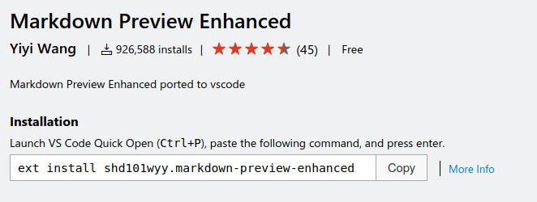
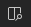
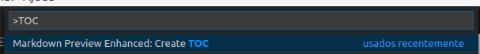
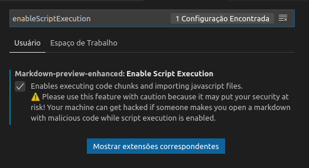
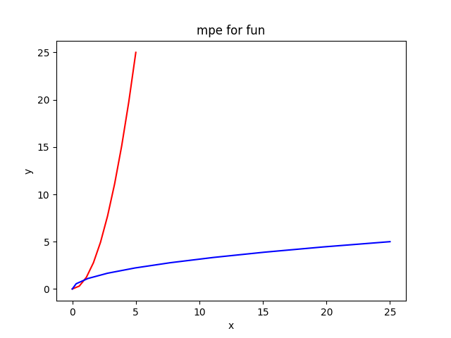
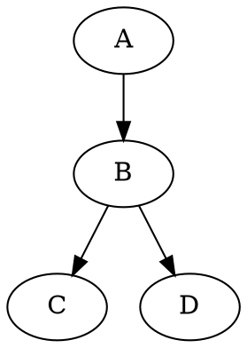
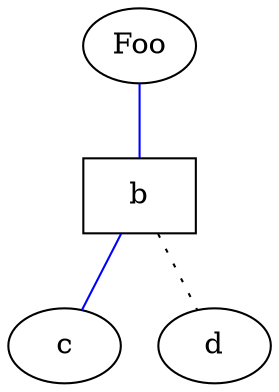
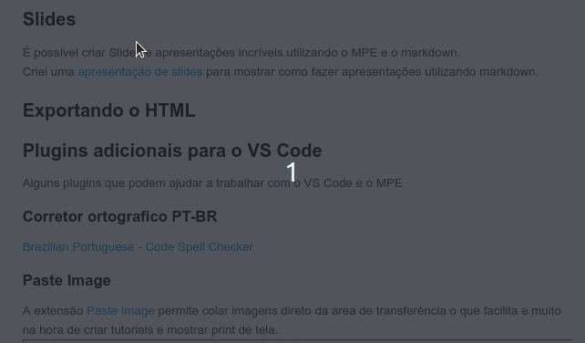

# Fazendo anotações e referências eficientes com o plugin Markdown Preview Enhanced para VS Code

## Introdução
Estudar programação pode ser um pouco difícil a quantidade de ferramentas e linguagens que um programador deve conhecer para trabalhar é muito grande, cada uma com suas formas de trabalhar, sintaxes diferentes e comandos únicos.

Memorizar tudo isso beira ao impossível, para resolver isso uma boa forma de escrever e armazenar esses conhecimentos pode ser de grande ajuda, mas é ai que começam os problemas.

Utilizar cadernos para anotações acaba gerando uma serie de limitações, sendo os principais portabilidade, acesso rápido e fácil, a não ser que você carregue um mochila com todos os seus cadernos 100% do tempo e ainda vai cair no problema do acesso rápido e fácil.

Desde 2018 eu utilizo o [TiddlyWiki](https://en.wikipedia.org/wiki/TiddlyWiki) uma especie de mini Wiki que roda em um arquivo HTML para armazenar meus estudos da area de TI. Ele é muito bom, permite escrever blocos de códigos e programas, alem de utilizar markdown o que facilita a escrita de um texto, mas tem algumas limitações como não permitir a criação de gráficos e fluxogramas, os blocos de códigos e comandos eram somente exibidos e não executados e algumas mudanças na forma dos navegadores trabalharem acabou por dificultar o salvamento dos seu tiddles.

Então conheci a extensão para VS Code [Markdown Preview Enhanced](https://marketplace.visualstudio.com/items?itemName=shd101wyy.markdown-preview-enhanced&WT.mc_id=blog-devto-ludossan) ela permitiu dar um salto na forma de armazenar e escrever estas anotações.

O [Markdown Preview Enhanced](https://marketplace.visualstudio.com/items?itemName=shd101wyy.markdown-preview-enhanced&WT.mc_id=blog-devto-ludossan) é uma extensão para VS Code que abre uma janela de preview do seu código markdown junto com um monte de funcionalidades, sendo as principais:

* Criação de gráficos, fluxogramas, diagramas e outros.
* Exportação automática para PDF.
* Execução de bloco de códigos.
* Criação de apresentação de slides.
* Criação e atualização de sumários.
* Integração com o Pandoc.
* Sincronismo de Scroll automático.
* Exibição de formulas matemáticas.

E mais um monte de outras coisas.

Graças a isso aos poucos estou cada vez mais utilizando-o para fazer minhas anotações ou até para criar arquivos de README mais interessantes nos meus projetos.

## Sumário

<!-- @import "[TOC]" {cmd="toc" depthFrom=1 depthTo=6 orderedList=false} -->

<!-- code_chunk_output -->

- [Fazendo anotações e referências eficientes com o plugin Markdown Preview Enhanced para VS Code](#fazendo-anotações-e-referências-eficientes-com-o-plugin-markdown-preview-enhanced-para-vs-code)
  - [Introdução](#introdução)
  - [Sumário](#sumário)
  - [Instalação](#instalação)
  - [Utilizando o Markdown](#utilizando-o-markdown)
    - [Marcadores do markdown](#marcadores-do-markdown)
  - [Vídeos do Youtube](#vídeos-do-youtube)
  - [Funcionalidades do Markdown Preview Enhanced](#funcionalidades-do-markdown-preview-enhancedhttpsmarketplacevisualstudiocomitemsitemnameshd101wyymarkdown-preview-enhancedwtmc_idblog-devto-ludossan)
    - [Atalhos do Markdown Preview Enhanced](#atalhos-do-markdown-preview-enhanced)
    - [Criando sumário automaticamente](#criando-sumário-automaticamente)
    - [Conversão ao salvar](#conversão-ao-salvar)
    - [Importando arquivos externos](#importando-arquivos-externos)
      - [Importando imagens](#importando-imagens)
      - [Importando arquivos CSV](#importando-arquivos-csv)
      - [Importando código fonte](#importando-código-fonte)
    - [Latex](#latex)
    - [Notas de rodapé](#notas-de-rodapé)
    - [Blocos de código](#blocos-de-código)
      - [Executando código javascript](#executando-código-javascript)
      - [Executando código Python](#executando-código-python)
    - [Diagramas](#diagramas)
      - [Flow Charts](#flow-charts)
      - [Diagrama de sequencia](#diagrama-de-sequencia)
      - [Diagrams com GraphViz](#diagrams-com-graphviz)
        - [Gráficos não direcionados](#gráficos-não-direcionados)
    - [Slides](#slides)
    - [Exportando o HTML](#exportando-o-html)
    - [Plugins adicionais para o VS Code](#plugins-adicionais-para-o-vs-code)
      - [Corretor ortografico PT-BR](#corretor-ortografico-pt-br)
      - [Paste Image](#paste-image)
  - [Conclusão](#conclusão)
- [Referências](#referências)

<!-- /code_chunk_output -->


## Instalação
Baixe e instale o [VS Code](https://code.visualstudio.com/?WT.mc_id=blog-devto-ludossan) no seu computador, caso não tenha ainda.

Para instalar a extensão [Markdown Preview Enhanced](https://marketplace.visualstudio.com/items?itemName=shd101wyy.markdown-preview-enhanced&WT.mc_id=blog-devto-ludossan), com o VS Code aberto você pode ir até a lateral e clicar no painel de extensões 


Pesquise [Markdown Preview Enhanced](https://marketplace.visualstudio.com/items?itemName=shd101wyy.markdown-preview-enhanced&WT.mc_id=blog-devto-ludossan) na caixa de pesquisa

Clique no botão `Install`, pronto! 

Outra forma mais rápida é acessando o site da extensão [Markdown Preview Enhanced](https://marketplace.visualstudio.com/items?itemName=shd101wyy.markdown-preview-enhanced&WT.mc_id=blog-devto-ludossan) e copiar o código de instalação



Com o código copiado, volte para o VS Code, abra o lançador de comandos `(CTRL+P)` ou `F1` cole o comando e aperte `ENTER`

Com a extensão instalada, basta abrir ou criar um arquivo com a extensão `.md` que o VS Code irá detectar e habilitar a opção de abrir o Preview do que está sendo editado, clique no botão no canto superior direito 



para ativar.


## Utilizando o Markdown
Markdown é uma linguagem de marcação de texto fácil de aprender e usar, inicialmente ele foi criado para ser um marcador de texto mais fácil e menos verboso de usar para criar textos HTML, hoje ele pode ser facilmente convertido para vários formatos de documentos diferentes: 

* HTML
* PDF
* World
* ODT
* RTF

e por ter uma licença [aberta](https://daringfireball.net/projects/markdown/license), vez ou outra surge algum outro formato de exportação.

Textos em markdown são documentos de texto puro, que podem ser abertos em qualquer computador, celular, tablet, notebook, etc, e que utilizam para estilização caracteres não-alfabéticos, como \#, \\* e \!\[]() que serão convertidos para títulos, listas, itálicos, negrito, imagens, etc. 

Por exemplo para marcar uma frase com negrito, escreva ela dentro dos marcadores \** :
`**frase em negrito**` tem como resultado **frase em negrito**

### Marcadores do markdown 
Abaixo estão alguns marcadores:
```
Texto com ênfase:

*enfatizado* (e.g., itálico)

**fortemente enfatizado** (e.g., negrito)

Código:

`código`

Listas:

* Um item em uma lista não ordenada
* Outro item em uma lista não ordenada

1. Um item em uma lista ordenada
2. Outro item em uma lista ordenada

Cabeçalhos:

# Cabeçalho de primeiro nível

#### Cabeçalho de quarto nível

Sintaxe alternativa para os dois primeiros cabeçalhos:

Cabeçalho de primeiro nível
====================

Cabeçalho de segundo nível
--------------------

Citações:

> Esse texto será envolto pelo elemento HTML blockquote.

Links:

[Texto do link](http://example.com/ "Propriedade title, opcional")

Imagens:


Lista de Tarefas 
- [x] @mentions, #refs, [links](), **formatting**, and <del>tags</del> supported
- [x] list syntax required (any unordered or ordered list supported)
- [x] this is a complete item
- [ ] this is an incomplete item
```

## Vídeos do Youtube

[](https://www.youtube.com/watch?v=ackZ-Ei4JB8) 


## Funcionalidades do [Markdown Preview Enhanced](https://marketplace.visualstudio.com/items?itemName=shd101wyy.markdown-preview-enhanced&WT.mc_id=blog-devto-ludossan)

### Atalhos do Markdown Preview Enhanced

Para começar vamos aprender alguns atalhos do MPE (Markdown Preview Enhanced).
* `CTRL+k v`: Abre a pré-visualização lateral.
* `CTRL+SHIFT+v`: Abre a pré-visualização.
* `ESC`: Dentro da pré-visualização abre/fecha o Sumário.
* `SHIFT+ENTER`: Executa um bloco de código.
* `CTRL+SHIFT+ENTER`: Executa todos os blocos de código.
* `CTRL+=`: Aumenta o zoom.
* `CTRL+-`: Diminui o zoom.
* `CTRL+0`: Reseta o zoom.

> As dicas abaixo funcionam com o MPE (Markdown Preview Enhanced) junto com o VS Code. Em outros interpretadores de Markdown eles podem simplesmente não funcionar ou depender de instalação de plugins para funcionar corretamente.

### Criando sumário automaticamente
Para criar um súmario do seu texto utilize o comando `CTRL\CMD + SHIFT + P` e digite `TOC`.



O [Markdown Preview Enhanced](https://marketplace.visualstudio.com/items?itemName=shd101wyy.markdown-preview-enhanced&WT.mc_id=blog-devto-ludossan) vai buscar todos os títulos com `#` até nível 6 (configurável) e criar um sumário.
> É necessário salvar o arquivo para que o sumário seja criado ou atualizado.

### Conversão ao salvar

Podemos configurar nosso arquivo markdown para, utilizando o [Pandoc](https://pandoc.org/) salve automaticamente nosso texto em outro formato.
Para configurar é necessário adicionar um [Front Matter](https://www.scribendi.com/advice/front_matter.en.html) no inicio, antes de qualquer coisa, do nosso arquivo.  

```
---
title: "Titulo do nosso arquivo"
author: "Nome do autor"
export_on_save:
  pandoc: true
output:
  pdf_document:
    path: ./file/path.pdf
---
```

Caso a opção `path:` seja omitida, o arquivo será criado no mesmo diretório do texto.


### Importando arquivos externos

Para importar arquivo externos utilize `@import "nome do arquivo"`.


Os formatos suportados são:

* Imagens (jpg, png, gif, apng, svg e bmp)
* CSV (vai ser convertido em uma tabela em markdown)
* .mermaid
* .plantuml ou puml
* .html
* .js (vai ser incluído em um bloco \<script>)
* .less ou .css (será incluído como style na página)
* .pdf
* .md

Exemplos:

#### Importando imagens
```
@import "assets/img/2020-05-02-11-53-43.png"
```
@import "assets/img/2020-05-02-11-53-43.png"
```
@import "assets/img/2020-05-02-11-53-43.png"" {width="300px" height="200px" alt="my image"}
```
@import "assets/img/2020-05-02-11-53-43.png"" {width="300px" height="200px" alt="my image"}

#### Importando arquivos CSV
```
@import "assets/planilha.csv"
```
@import "assets/planilha.csv"


#### Importando código fonte
```
@import "assets/script.json" {code_block=true class="line-numbers"}
```
@import "assets/script.json" {code_block=true class="line-numbers"}

### Latex

Para utilizando o [Latex](https://shd101wyy.github.io/markdown-preview-enhanced/#/math) basta escrever a formula dentro do bloco `$$`:

Exemplo `$$\Delta = b² - 4*ac$$` gera a formula:

$$\Delta = b² - 4*ac$$

E a formula `$$\lim_{x\to\infty} \frac{1}{x}$$` tem como resultado:
$$\lim_{x\to\infty} \frac{1}{x}$$

Outro exemplo `$$\sum_{n=1}^{100} n$` $$\sum_{n=1}^{100} n$$

Para ver como gerar mais formulas vejas a [documentação](https://katex.org/docs/supported.html)

### Notas de rodapé
Também é possível criar notas de rodapé, o código abaixo:
```
William de Paula [^1]

[^1]:[Official WebSite](williamdepaula.github.io/)

```
Gera como resultado

William de Paula [^1]

[^1]:[Site Pessoal](williamdepaula.github.io/)

### Blocos de código
É possível gerar blocos de código executável dentro do nosso arquivo markdown, código de qualquer tipo pode ser executado, bastando para isso ter o executável na sua máquina.

Por padrão a execução de scripts vem desativada dentro do VS Code, para isso vamos ter que ativa-la dentro das preferencias.

Vá em `Arquivo->Preferências->Configurações` ou use o atalho `CTRL+,` no campo de busca escreva `enableScriptExecution` marque o checkbox para ativar.



#### Executando código javascript
Abra o bloco com ` ```javascript {cmd="node"}` coloque seu comandos e depois feche com ` ``` ` 
Exemplo:

```javascript {cmd="node" .line-numbers}
const data = new Date()
console.log(data)
```
Lembrando que o **node** tem que estar instalado na maquina para funcionar corretamente.

#### Executando código Python

```python {cmd=true .line-numbers}
print("Olá mundo!")
```

Para este exemplo funcionar o interpretador python deve estar instalado

Também é possível utilizar a biblioteca matplotlib para gerar gráficos

```python {cmd=true matplotlib=true .line-numbers}
import matplotlib.pyplot as plt
plt.plot([1,2,3,4])
plt.show()
```

Caso tenha problemas com a importação da biblioteca matplotlib instale, em sistemas Debian like, com o comando abaixo:

```shell {.line-numbers}
$ python -m pip install -U matplotlib
```
> O gráfico gerado pode não ser exibido corretamente na exportação com o pandoc, uma forma de contornar isso é salvando a imagem do gráfico e depois importando ele dentro do markdown.

```python {cmd=true matplotlib=true .line-numbers}
import matplotlib
import matplotlib.pyplot as plt
import numpy as np
x = np.linspace(0, 5, 10)
y = x ** 2
 
plt.plot(x, y, 'r')
plt.plot(y, x, 'b')
plt.xlabel('x')
plt.ylabel('y')
plt.title('mpe for fun')
plt.savefig('assets/img/grafico.png')
```



> Lembre-se de omitir a linha `plt.show()` para o gráfico não ficar duplicado na apresentação do seu texto

### Diagramas
MPE também tem suporte a criação de vários tipos de [diagramas e grafos](https://shd101wyy.github.io/markdown-preview-enhanced/#/diagrams?id=mermaid). Ele tem suporte aos seguintes formatos:

* Fluxogramas (flow charts)
* Diagramas de sequencia (sequence diagrams)
* Mermaid
* PantUML
* WaveDrom
* GraphViz
* Vega & Vega-lite
* Ditaa diagrams


#### Flow Charts
* Crie um bloco de código com a notação ` ```flow `e ele será renderizado utilizando o [flowchart.js](https://flowchart.js.org/)

```flow
st=>start: Start:>http://www.google.com[blank]
e=>end:>http://www.google.com
op1=>operation: My Operation
sub1=>subroutine: My Subroutine
cond=>condition: Yes
or No?:>http://www.google.com
io=>inputoutput: catch something...
para=>parallel: parallel tasks

st->op1->cond
cond(yes)->io->e
cond(no)->para
para(path1, bottom)->sub1(right)->op1
para(path2, top)->op1
```

#### Diagrama de sequencia
* Crie um bloco de código com a notação ` ```sequence` que ele será renderizado utilizando o [js-sequence-diagrams](https://bramp.github.io/js-sequence-diagrams/)
* Dois temas são suportados: simples(thema padrão) e hand

```sequence{theme="hand"}
Andrew->China: Says Hello
Note right of China: China thinks\nabout it
China-->Andrew: How are you?
Andrew->>China: I am good thanks!
```

#### Diagrams com GraphViz

* Crie um bloco de código com a notação ` ```dot` ou ` ```viz` que ele será renderizado utilizando a biblioteca [Viz.js](https://github.com/mdaines/viz.js).
* É possível escolher uma engine diferente utilizando o marcador {engine="..."}. As engine circo, dot(engine default), neato, osage, ou twopi são suportadas.
* Utiliza a [DOT (graph description language)](https://en.wikipedia.org/wiki/DOT_(graph_description_language)) para criar os gráficos.
* Veja a [documentação](https://en.wikipedia.org/wiki/DOT_(graph_description_language)#Graph_types) para criar gráficos




##### Gráficos não direcionados


### Slides
É possível criar Slides e apresentações incríveis utilizando o MPE e o markdown.
Criei uma [apresentação de slides](Slides.md) para mostrar como fazer apresentações utilizando markdown.

### Exportando o HTML
Para exportar para html, clique com o botão direito dentro do preview e selecione `HTML -> HTML (offline)`, um arquivo html será criado dentro da pasta do projeto.



### Plugins adicionais para o VS Code
Alguns plugins que podem ajudar a trabalhar com o VS Code e o MPE

#### Corretor ortografico PT-BR
[Brazilian Portuguese - Code Spell Checker](https://marketplace.visualstudio.com/items?itemName=streetsidesoftware.code-spell-checker-portuguese-brazilian)

#### Paste Image
A extensão [Paste Image](https://marketplace.visualstudio.com/items?itemName=mushan.vscode-paste-image&WT.mc_id=devto-blog-ludossan) permite colar imagens direto da area de transferência o que facilita e muito na hora de criar tutoriais e mostrar print de tela.


Para colar utilize `CTRL+ALT+v`

Caso queira configurar entre em `Arquivo -> Preferencias -> Configurações` ou `CTRL+,` digite `pasteImage`para mostrar as configurações da extensão.

## Conclusão

O plugin Markdown Preview Enhanced permite melhorar em muito anotações de estudos e referências de utilização, a possibilidade de utilizar varias ferramentas diferentes permite a criação de anotações de forma eficiente, o uso de markdown permite se focar no que você está estudando no momento, sem roubar a atenção para um monte de botoẽs e funcionalidades que um editor de texto como o Word ou LibreOffice podem fazer.

Como todos as sua anotações serão arquivos de texto puro, se necessário basta um bloco de notas para ter acesso ao seu conteúdo, garantindo fácil exportação para outras ferramentas futuras que podem surgir. 

O conteúdo em texto puro também permite uma boa integração com o GIT, adicionando um controle de versão robusto e confiável. Se você subir ele em um GITHUB ou GITLAB é possível garantir o acesso de qualquer dispositivo conectado a internet.  

# Referências

[Escrita Eficiente de Artigos com VSCode](https://dev.to/azure/escrita-eficiente-de-artigos-com-vscode-1am4)
