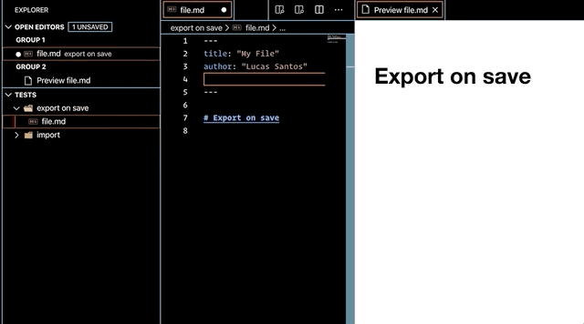
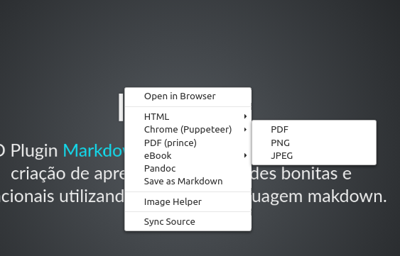

---
presentation:
  enableSpeakerNotes: true
  theme: league.css
---

<!-- slide -->
# Como Criar Slides com Markdown

<!-- slide -->
## Introdução
O Plugin [Markdown Preview Enhanced](https://marketplace.visualstudio.com/items?itemName=shd101wyy.markdown-preview-enhanced&WT.mc_id=blog-devto-ludossan) permite a criação de apresentações de slides bonitas e funcionais utilizando somente a linguagem makdown.

<!-- slide -->
## Novo slide
Adicione `<!-- slide -->` no markdown ou abra o lançador de comandos `CTRL+SHIFT+p` ou `F1` e escrever `Markdown Preview Enhanced: Insert New Slide`

<!-- slide -->
## Todos os marcadores markdown são suportados

<!-- slide -->
## Formulas

$$e=mc²$$
$$\Delta = b² - 4*ac$$
$$\lim_{x\to\infty} \frac{1}{x}$$


<!-- slide -->

## Imagens


<!-- slide -->

## Importação de arquivos
@import "assets/planilha.csv"

<!-- slide -->

## Blocos de código

#### Python
```python {.line-numbers}
# Bloco de código python
print("Olá Mundo")
```
#### Java
```java {.line-numbers}
class Simple{
  public static void main(String args[]){
    System. out. println("Hello Java");
 }
}
```

<!-- slide -->
A apresentação pode ser fácilmente configurada, bastando adicionar um front-matter no começo do arquivo.
```
---
presentation:
width: 800
height: 600
---
```

Mais informações podem ser encontradas na [documentação](https://shd101wyy.github.io/markdown-preview-enhanced/#/presentation)


<!-- slide -->
Por padrão, os slides são alinhados horizontalmente, mas é possível criar slides vertical adicionando `vertical=true`

```
<!-- slide vertical=true -->
```
<!-- slide vertical=true -->

Slide vertical!

<!-- slide -->
É possível set o background do slide facilmente.
```
<!-- slide data-background-color="#ff0000" -->
```
<!-- slide data-background-color="#ff0000" -->

Slide com fundo vermelho

<!-- slide data-background-image="assets/img/background.jpg" -->

Outros parâmetros do background podem ser passados:
* data-background-image : URL para a imagem, GIFs serão reiniciados quando o slide for aberto.
* data-background-size
* data-background-position
* data-background-repeat

<!-- slide -->
É possível utilizar um vídeo como background e até um iframe.
*  data-background-video : Um vídeo simples, ou lista de vídeos separados por virgula.
* data-background-video-loop : Flag que faz com que o vídeo seja repetido indefinidamente.
* data-background-iframe : Uma página como background.

<!-- slide vertical=true data-background-video="https://s3.amazonaws.com/static.slid.es/site/homepage/v1/homepage-video-editor.mp4,https://s3.amazonaws.com/static.slid.es/site/homepage/v1/homepage-video-editor.webm" data-background-video-loop data-background-video-muted -->

```

<!-- slide 
data-background-video="https://s3.amazonaws.com/static.slid.es/site/homepage/v1/homepage-video-editor.mp4,https://s3.amazonaws.com/static.slid.es/site/homepage/v1/homepage-video-editor.webm" 
data-background-video-loop 
data-background-video-muted -->

```


<!-- slide data-background-image="assets/img/akira.jpg" data-transition="convex" -->

Também é possível alterar a transmissão do slide

```
<!-- slide data-background-image="assets/img/akira.jpg" data-transition="convex" -->

```
valores possíveis são 

```
none/fade/slide/convex/concave/zoom

```

<!-- slide -->
Para gerar o PDF da apresentação, é necessário o o Google Chrome ou Chromium instalado, clique com o botão direito sobre a apresentação e selecione `Chrome (Puppeteer) -> PDF`


<!-- slide -->

## Referências
[Presentation Writer by Markdown Preview Enhanced](https://rawgit.com/shd101wyy/markdown-preview-enhanced/master/docs/presentation-intro.html)
 
[The HTML Presentation Framework ](https://github.com/hakimel/reveal.js)

[REVEAL.JS - The HTML Presentation Framework](https://www.slideshare.net/hakimel/revealjs-300)